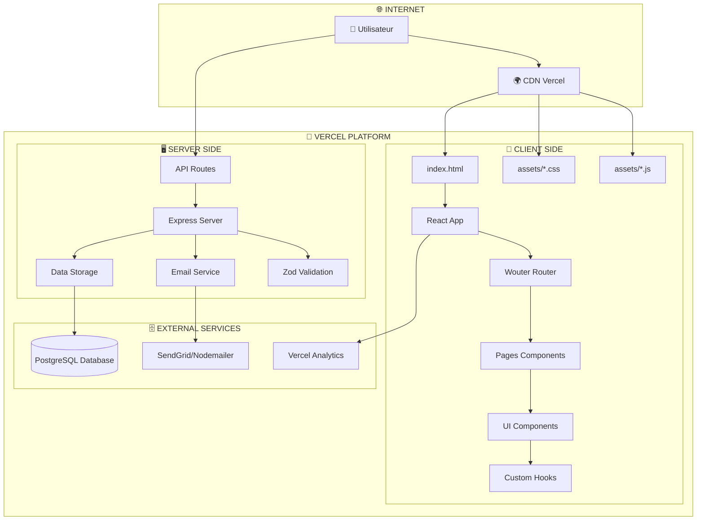
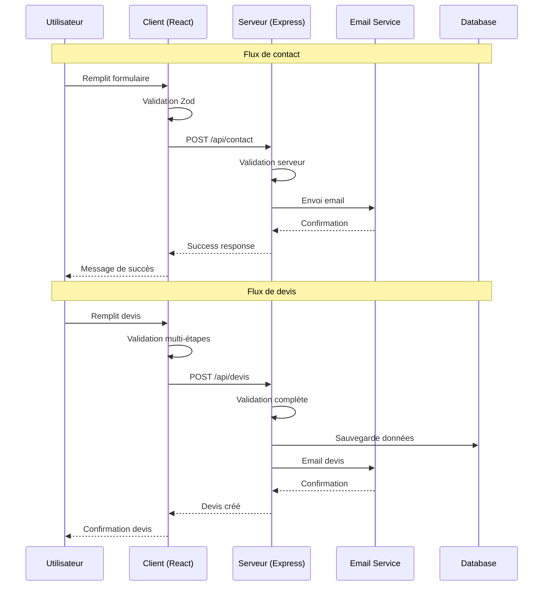
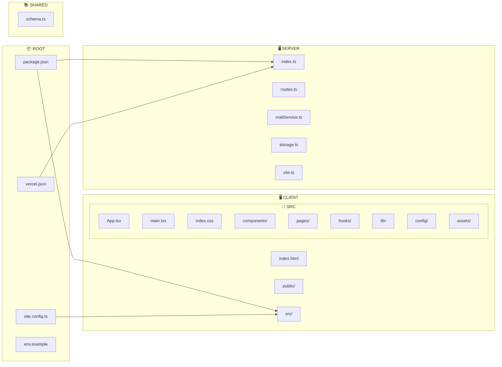
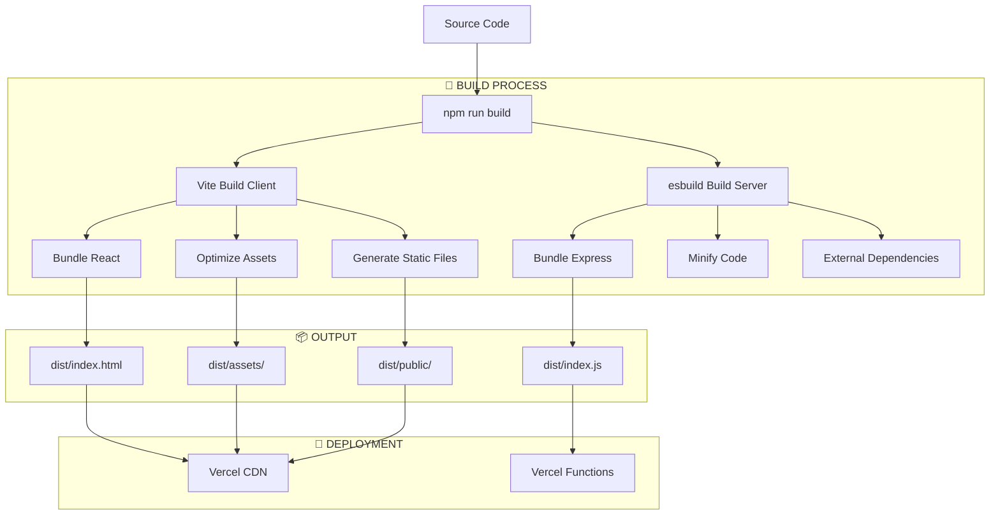
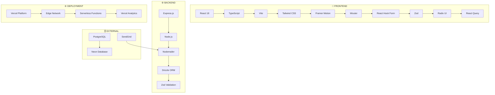
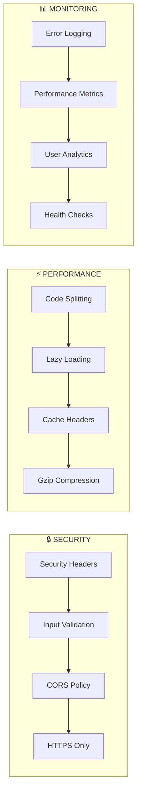

# Diagramme d'Architecture BorneFlix

## 🏗️ **Architecture Complète**

## 🔄 **Flux de Données**

## 📁 **Structure des Fichiers**

## 🚀 **Processus de Build**

## 🔧 **Technologies Stack**

## 🔒 **Sécurité et Performance**

## 🎯 **Points Clés de l'Architecture**

### **✅ Avantages :**
- **Performance** : Code splitting + Lazy loading
- **Sécurité** : Headers + Validation stricte
- **Scalabilité** : Serverless + CDN global
- **Maintenance** : TypeScript + Modularité
- **SEO** : SSR-ready + Métadonnées complètes
- **Monitoring** : Analytics + Logs intégrés

### **🔄 Flux de données :**
1. **Client** → Validation locale → API Request
2. **Serveur** → Validation serveur → Traitement → Response
3. **Client** → Mise à jour UI → Feedback utilisateur

### **🚀 Déploiement :**
- **Build** : Vite + esbuild optimisé
- **Deploy** : Vercel automatique
- **CDN** : Edge Network global
- **Functions** : Serverless API

**L'architecture est moderne, performante et prête pour la production ! 🎉** 